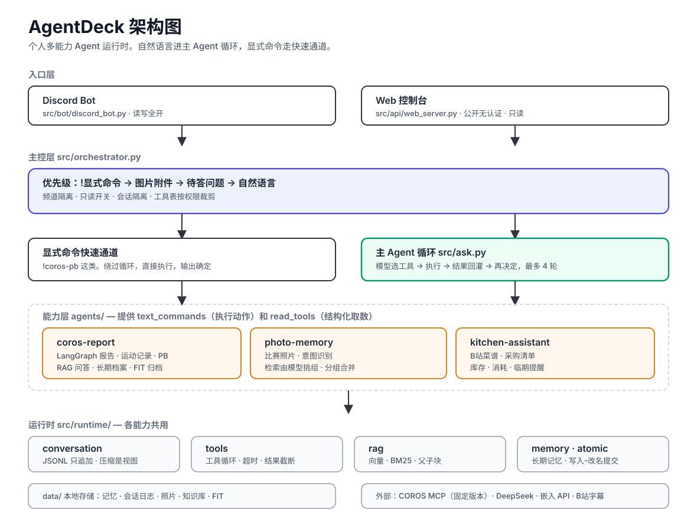

# AgentDeck

个人多能力 Agent 运行时，当前主要通过 Discord 和 Web Console 交互。

当前包含三个主要能力：

- `coros-report`：COROS 运动报告、LangGraph 工作流、RAG 训练问答、跑步视频知识导入和长期训练记忆。
- `kitchen-assistant`：从 B 站字幕提取菜谱，管理采购清单、库存、食材消耗和临期提醒。
- `photo-memory`：在 Discord 保存比赛照片，记录比赛日期、成绩等元数据，并按自然语言检索后发送照片。照片操作（新建 / 追加 / 补充信息 / 检索 / 合并分组）由能力内部的意图识别判断，检索也由模型直接挑分组而非关键词匹配，用户说原话即可。

## 架构



运行时被拆成可复用的主 Agent 层和领域 Capability。Discord 消息从 `src/bot/discord_bot.py` 进入，Web Demo 从 `src/api/web_server.py` 进入，主控层负责自然语言路由、权限隔离和命令分发，具体业务由已注册的 capability 执行。

## 多轮对话

`src/runtime/conversation.py` 提供进程内的多轮会话历史，保留最近 6 轮消息，让 Agent 在追问之后能承接用户的回答，而不是把答案当成一次全新的提问。

会话按来源隔离：Discord 用频道 ID，Web 用前端 `sessionStorage` 生成的 session id。历史只存在内存中，进程重启即清空。

## Web 控制台

公开地址 [agent.noahwang.run](https://agent.noahwang.run)。

页面是一个单栏对话产品：直接用自然语言提问，主 Agent 会自动判断该调用哪个能力，用户不需要选择 Agent 或记命令。

本地启动：

```bash
uv run python -m src.api.web_server --host 127.0.0.1 --port 8787
```

打开 <http://127.0.0.1:8787>。

`WEB_AGENT_MODE` 控制运行模式：

- `demo`（默认）：走本地关键词假路由和固定文案，不调用任何外部服务，可以离线演示。
- `real`：调用与 Discord 相同的真实 capability，需要配置 `.env` 里的模型和数据源密钥。

项目迭代记录见 [docs/project-iteration-report.md](docs/project-iteration-report.md)。
